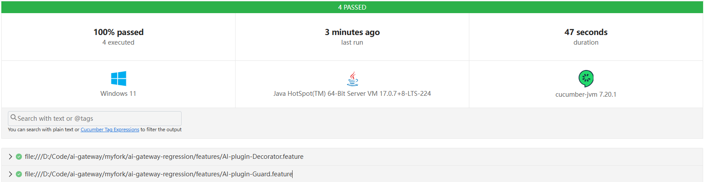
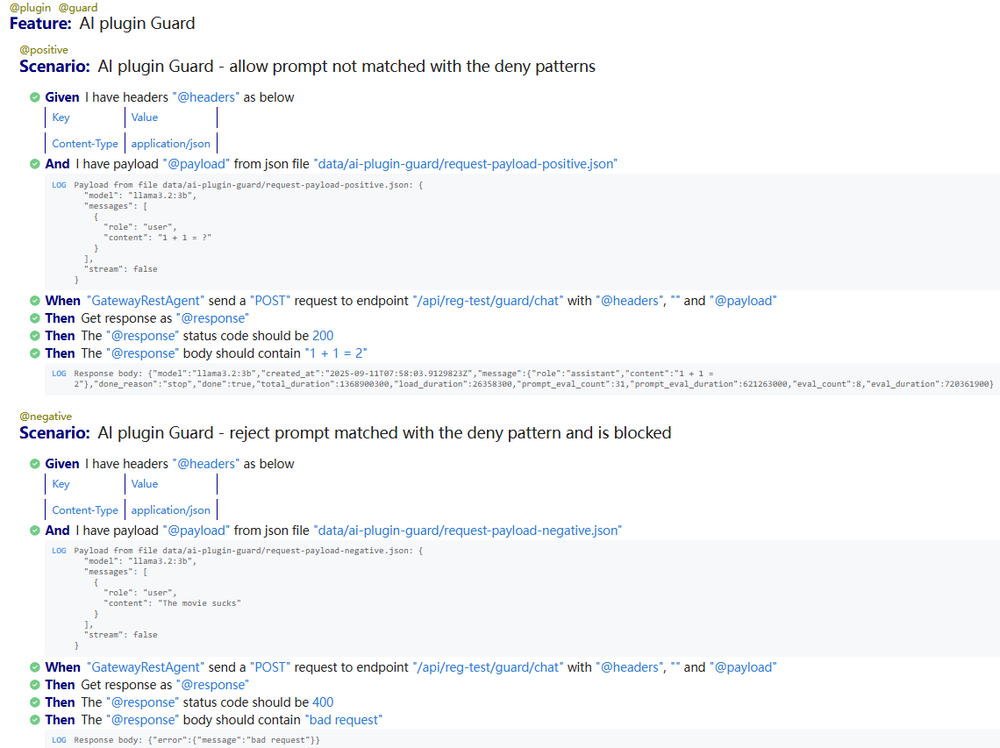
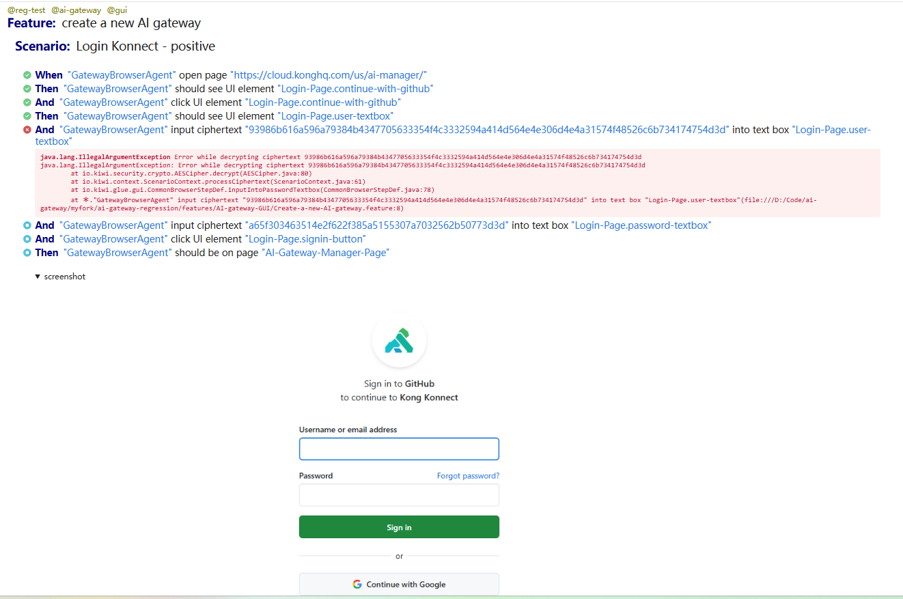

# ai-gateway-regression
This project is a BDD functional regression test suite implemented using Java and Cucumber for an AI gateway. It leverages the Cucumber framework to define and execute behavior-driven development (BDD) tests, allowing for clear and concise test scenarios that are easy to understand and maintain.

## Prerequisites
- Java Development Kit (JDK) 17 or higher
- Maven 3.6 or higher
- An IDE such as IntelliJ IDEA
- Git
- Access to the AI gateway application under test
- Basic knowledge of Java, Cucumber, and BDD principles

## Getting Started
1. **Clone the Repository**: Start by cloning the repository to your local machine using Git.
2. **Install Dependencies**: Navigate to the project directory and run `mvn clean install` to download all necessary dependencies and generate jar package e.g. ai-gateway-regression-1.0-SNAPSHOT.jar.
3. **Configure Environment**: Set up any required environment variables or configuration files needed to connect to the AI gateway application.
4. **Run Tests**: 
    ```bash
    java -jar ai-gateway-regression-1.0-SNAPSHOT.jar --tags @plugin`
    ``` 
    This will run Cucumber scenarios with tag `@plugin`. You can replace `@plugin` with any other tag defined in the feature files to run specific tests, all scenarios will be executed if no tag is provided.
5. **View Reports**: After test execution, view the generated reports in the `target/cucumber-reports` directory.

## Project Structure
- `src/main/java`: Contains the main Java code including automation core code and step definitions.
- `features`: Contains feature files and test resources.
- `config`: Contains configuration files for agents and reports
- `data`: Contains test data files and gateway settings e.g. route and plugin configurations.

## Configuration
- **Environment**: agents and reporting configurations are environment-specific (e.g. dev, QA, UAT, Prod). You can set the environment by specifying the `environment` property in root config file "config/config.yml".
- **Agents**: Configure different agents in the `config/{env}/agents.yml` directory. Each agent can have its own settings and credentials.
- **Reports**: Report configurations can be found in the `config/{env}/reporting.yml` directory. You can configure email and allure reporting.

### Agents Configuration Example
```yaml
- !io.kiwi.config.api.RestAgentConfig
   name: GatewayRestAgent
   requestAuth:
           !io.kiwi.security.auth.BearerToken
      token: your_token_here # Replace with your encrypted actual token
   baseUrl: http://localhost:8000 # Base URL for the API, default: http://localhost:8080
```

## Example Run Reports
- **Summary Report for sample scenario of plugin AI Guard**: 
- **Detailed Report for sample scenario of plugin AI Guard**: 
- **Detailed Report for sample scenario of Konnect Login**: 

